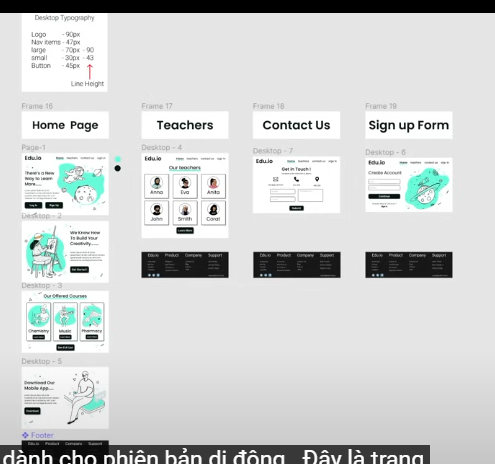
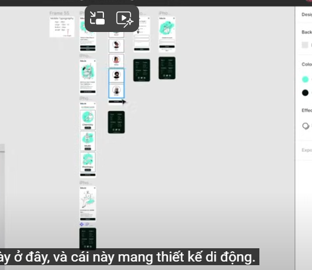
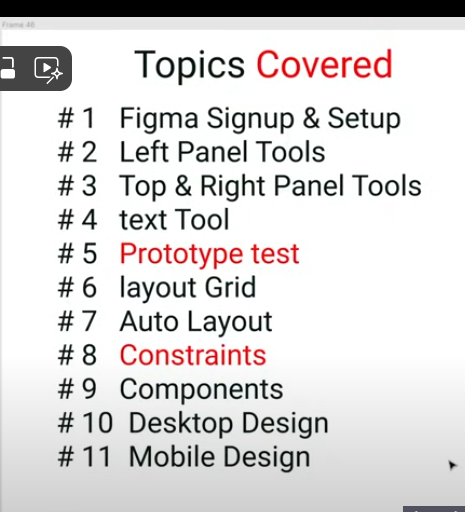
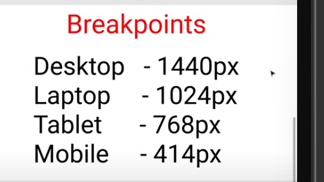

1. Mục đích: Tạo 1 Responsive Web Design:
   - 
   - 
   - Gồm:
     - Trang chủ
     - Trang Teaches
     - Trang contact 
2. Lộ trình:
   1. 
3. Chia thư mục, các quy tắc: 
   1. Tạo thư mục theo từng Giao diện, VD: Computer, Mobile
   2. Nên có 1 bảng hiển thị các thông tin: Font, Logo Size, ...
4. Figma Setup: 
   1. **Break Points**:
      1. 
